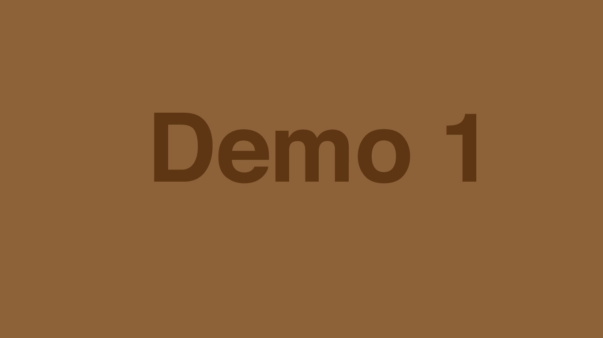

<h2>A GYM website demo</h2>
This website made by html, css, javascript <br />(vanilla)
<br/>
<br/>
<div align="center">
    <a href="#"><strong>↪ Live Demo</strong></a>
</div>
<br/>
<br/>
<h3>Demo image</h3>
<h2>A list</h2>

* click me
* click me

```bash
git clone https//:www.github.com
```

A bold **text** added


### heading
## heading
# heading





[MIT](# "license")